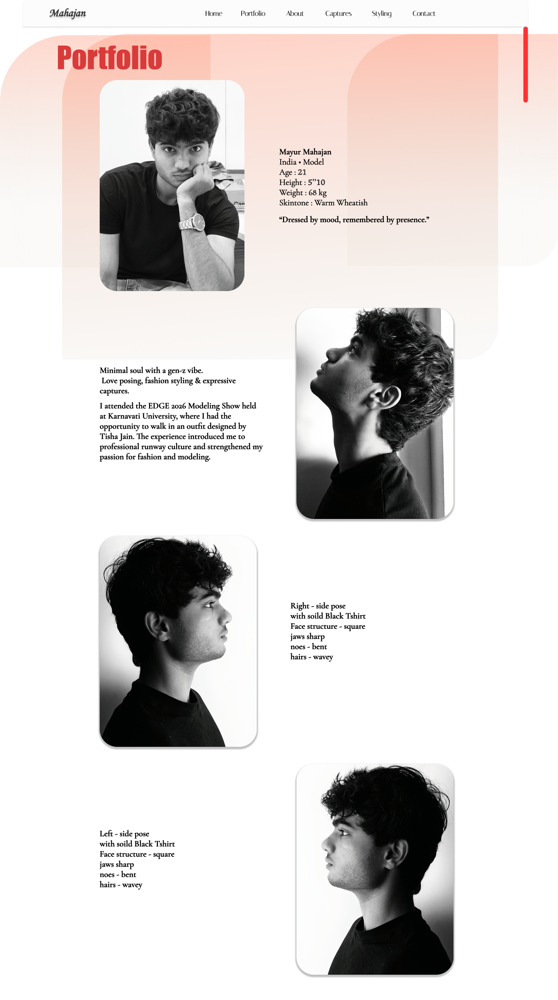
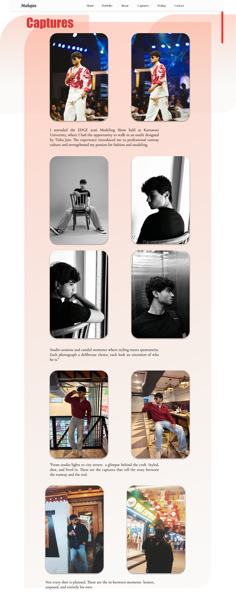

# Modeling-Portfolio-Figma
This project UI/UX was fully designed in Figma, including About me , Styling, Captures, Portfolio, and Contat us section having Dynamic workfloow
# Mayur Mahajan Portfolio

## Figma Prototype
https://www.figma.com/design/g8BXXXTmkzv5DQSHpmC6KN/Modeling-portfolio-figma?node-id=2058-54&t=IOSJrYoyP7mAGAAn-1

## Figma Design File
https://www.figma.com/design/g8BXXXTmkzv5DQSHpmC6KN/Modeling-portfolio-figma?node-id=2058-54&t=IOSJrYoyP7mAGAAn-1
# Mayur Mahajan Portfolio

## Portfolio Preview

### Portfolio

### About Me

### Styling

### Second Style

### Contact Me

### Captures

